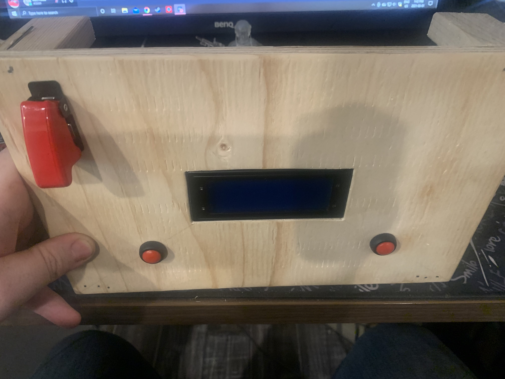
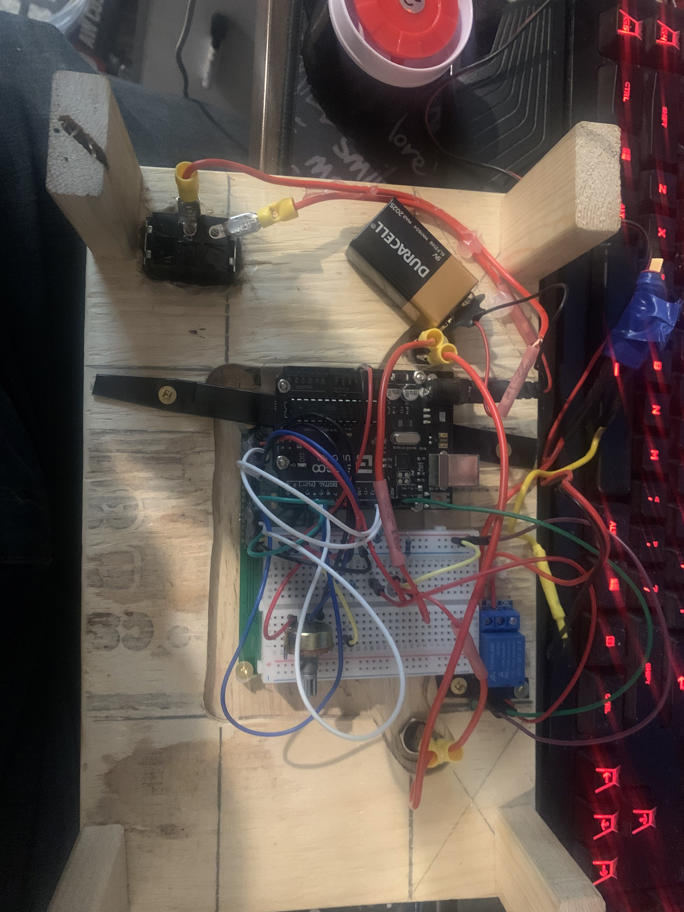

# PaintBallArduinoProject

Creating a fake prop bomb to be defused that takes a certain amount of secods to run.
The code must be uploaded to the board with the ArduinoIDE. 
Below there are a few pictures of parts of the prop. 

## Front Side

## Back Side

## Case Enclosure

